# Transactions Fraud Prediction

# Business Problem

The Fraud Blocker Company (FBC) is a company specialized in detecting fraud in financial transactions made through mobile devices. The company has a service called “Blocker Fraud” in which it guarantees the blocking of fraudulent transactions.

The company's business model is of the Service type with the monetization made for the performance of the service provided, that is, the customer pays a fixed fee on the success in detecting fraud in the customer's transactions. In addition, the FBC is expanding and to acquire customers more quickly, it has adopted te following aggressive strategy:

- FBC receives 25% of the transaction amount from a transaction that is truly detected as fraud (True Falses).

- FBC receives 5% of the transaction amount from a transaction detected as fraud, but the transaction is truly legitimate (False Positives).

- FBC refunds the bank 100% of the transaction amount from a transaction detected as legitimate, however the transaction is truly a fraud (False Negatives).

With this aggressive strategy, the company assumes the risks of failing to detect fraud and is remunerated for assertive fraud detection. For the client, it is an excellent business to hire the FBC. Although the fee charged is very high on success, 25%, the company reduces its costs with fraudulent transactions correctly detected and the damage caused by an error in the anti-fraud service will be covered by the FBC itself.

For this project, it will be considerate that a certain bank is about to hire the FBC services ("Fraud Blocker" model) and provided a dataset of transactions so we could create a model to manage its fraudulent transactions analysis.

# Objective and Solution Proposal

### Objective

Increase the Blocker Fraud Company (BFC) profit. By increase the actual fraud transaction analysis recall, precision and stability.

### Solution Proposal

Create a binary classification toll ("Blocker Fraud" model) with statics model and machine learning to increase the fraud diagnosis recall, precision and accuracy.

# Dataset Summary

- **`step`** - [int]: Maps a unit of time in the real world. In this case 1 step is 1 hour of time. Total steps 744 (30 days simulation)
- **`type`** - [categorical]: CASH-IN, CASH-OUT, DEBIT, PAYMENT and TRANSFER
- **`amount`** - [float]: Amount of the transaction in local currency
- **`nameOrig`** - [string]: Customer who started the transaction
- **`oldbalanceOrg`** - [float]: Initial balance before the transaction
- **`newbalanceOrig`** - [float]: New balance after the transaction
- **`nameDest`** - [string]: Customer who is the recipient of the transaction
- **`oldbalanceDest`** - [float]: Initial balance recipient before the transaction. Note that there is not information for customers that start with M (Merchants)
- **`newbalanceDest`** - [float]: New balance recipient after the transaction. Note that there is not information for customers that start with M (Merchants)
- **`isFraud`** - [binary]: This is the transactions made by the fraudulent agents inside the simulation. In this specific dataset the fraudulent behavior of the agents aims to profit by taking control or customers accounts and try to empty the funds by transferring to another account and then cashing out of the system
- **`isFlaggedFraud`** - [binary]: The business model aims to control massive transfers from one account to another and flags illegal attempts. An illegal attempt in this dataset is an attempt to transfer more than \$ 200.000 in a single transaction

#  Mind Map Hypoteses

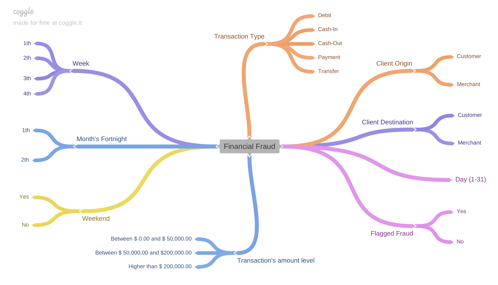 

# Exploratory Data Analysis

## Univariate Analysis

### Categorical Features Distribution Analysis

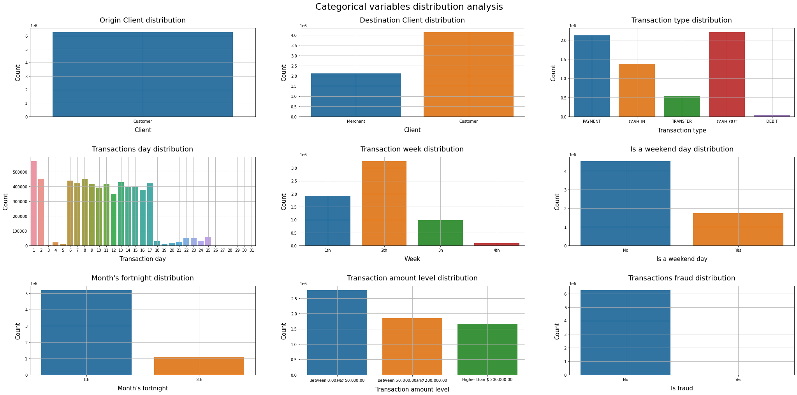 

- There are no transactions executed by Merchants
- Most of the transactions have account type customer as final destination
- Payment and Cash-Out as the most common type of transactions
- Transactions happens more often between day 6 and 17
- Transactions happens more often in the second month's week
- Transactions happens more during workweeks than weekends
- Transactions happens more often during the first month's fortnight
- There are more transactions with amounts between \$ 0.00 and \\$ 50,000.00 values than other amounts levels
- There is a almost percentage (close to 1%) of transactions which is a fraud, between all transactions executed

### Numerical Features Distribution Analysis

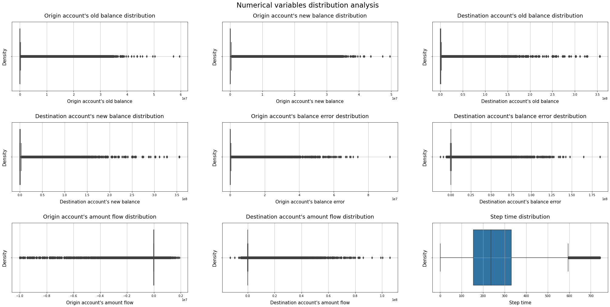 

All numerical variables have a large number of outliers yet, except the **`step`** feature.

## Bivariate Analysis

### Hypothesis 1: There are more fraudulent transactions in quantity through Cash-Out type

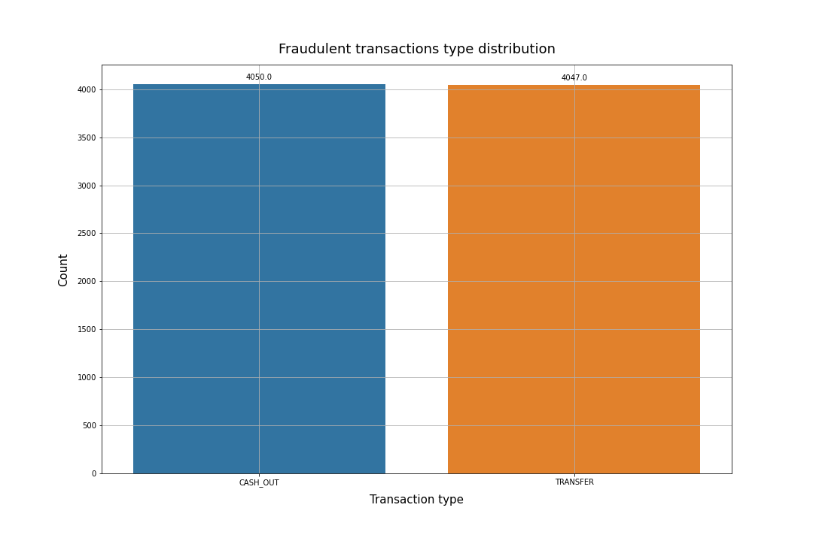 
There are just Transfer and Cash-Out type in fraudulent transactions.
The Transfer type is the most common type between both, surpassing with a slightly difference of 3.

### Hypothesis 2: There are more fraudulent transactions in total values through Transfer type

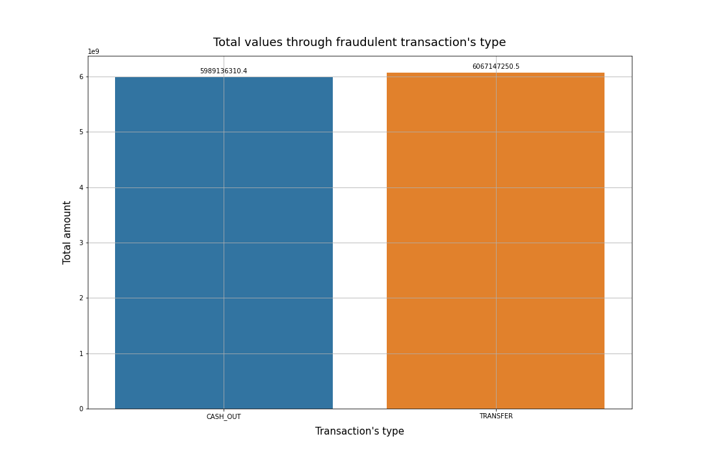 
Transfer type also have more fraudulent transactions executed in total values then Cash-Out type.

### Hypothesis 3: All transactions over $ 200,000.00 are fraudulents

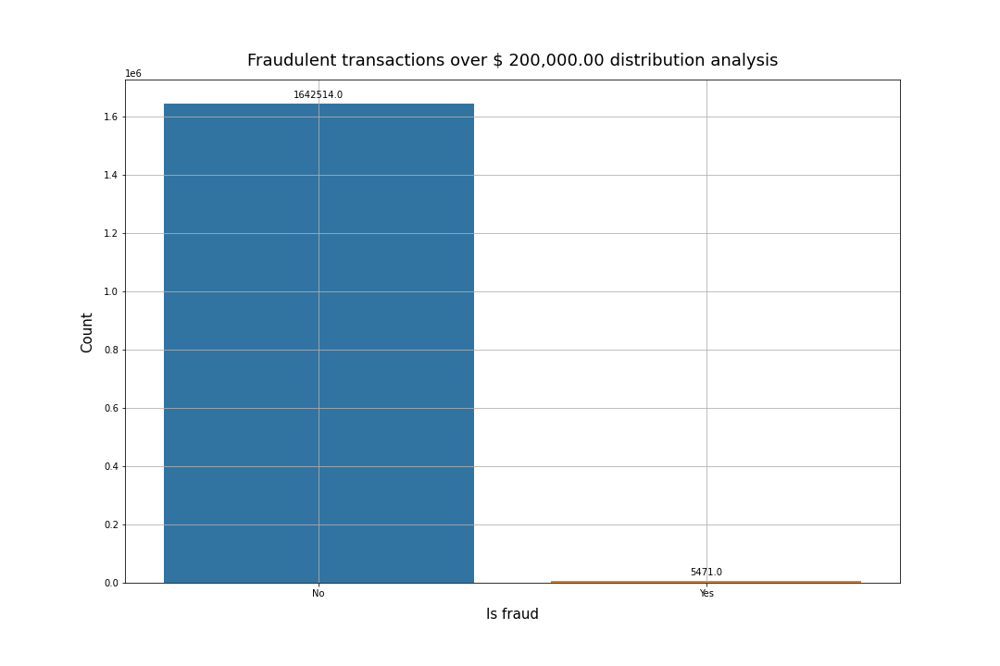 
Not all transactions over \$ 200,000.00 are fraudulent.
Only a small percentage of the transactions with \$ 200,000.00 amount or higher are fraudulent.

### Hypothesis 4: Transactions with amount values level between $ 50,000.00 and 200,000.00 are more likely to be fraudulent than the others amount levels

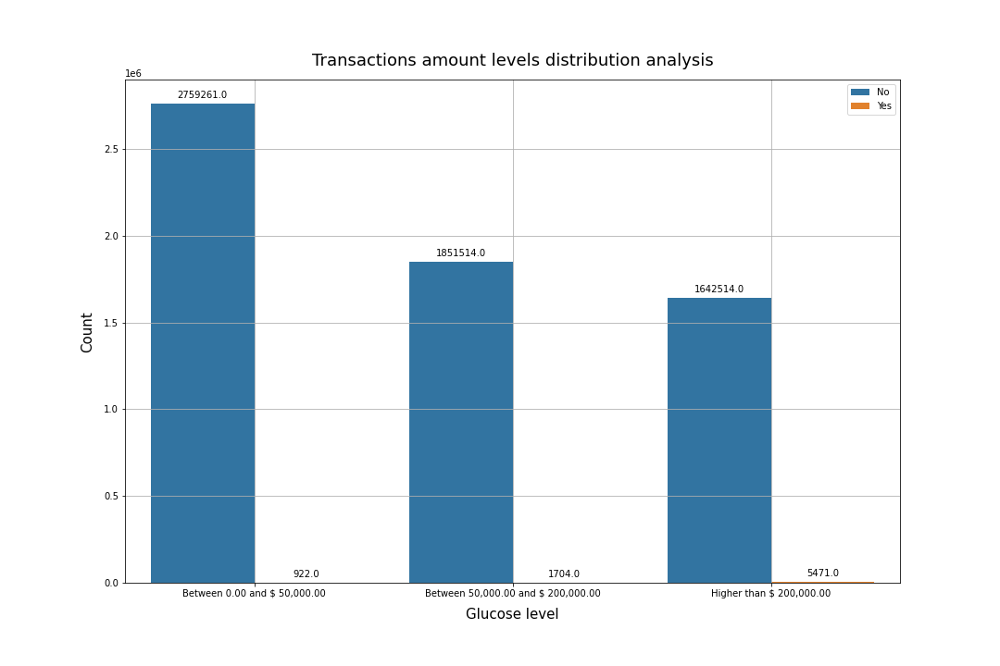 
Transaction level between $ 50,000.00 and \\$ 200,000.00 have more fraudulent transactions than between \\$ 0.00 and \\$ 50,000.00 level.
Transaction level with amounts higher than \$ 200,000.00 have more fraudulent transactions of all of them.

### Hypothesis 5: Fraudulent transations happens more to Customer-Customer than Customer-Merchant relation

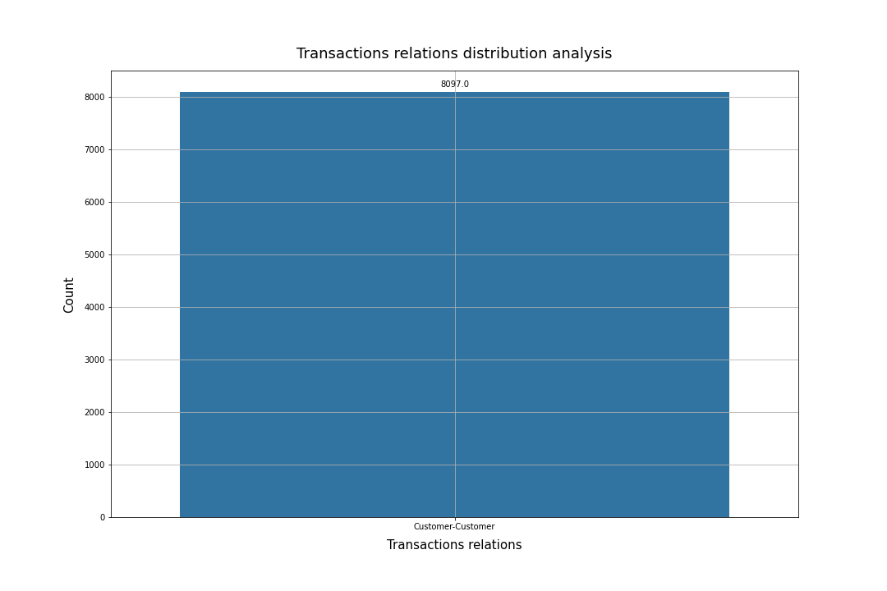 
There are only fraudulent transactions between Customer-Customer relation.

### Hypothesis 6: There is more chance of having a fraudulent transaction when the final origin's balance is zero

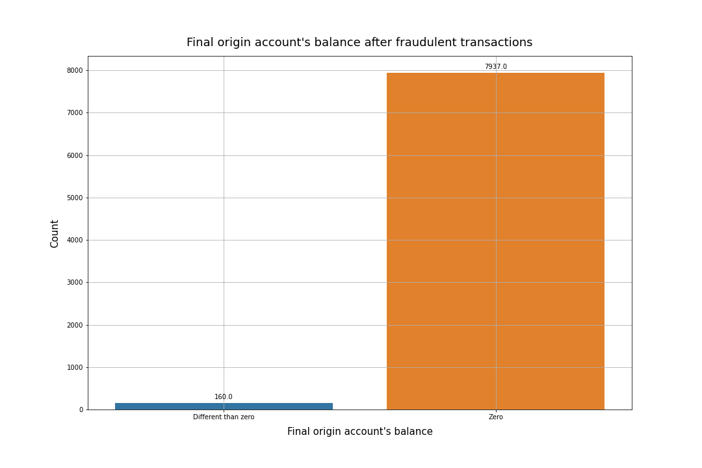 
Only a few percent of the fraudulent transactions leave the origin account's final balance with values different than zero.

### Hypothesis 7: Fraudulent transactions tends to happen more on the weekends than workweek

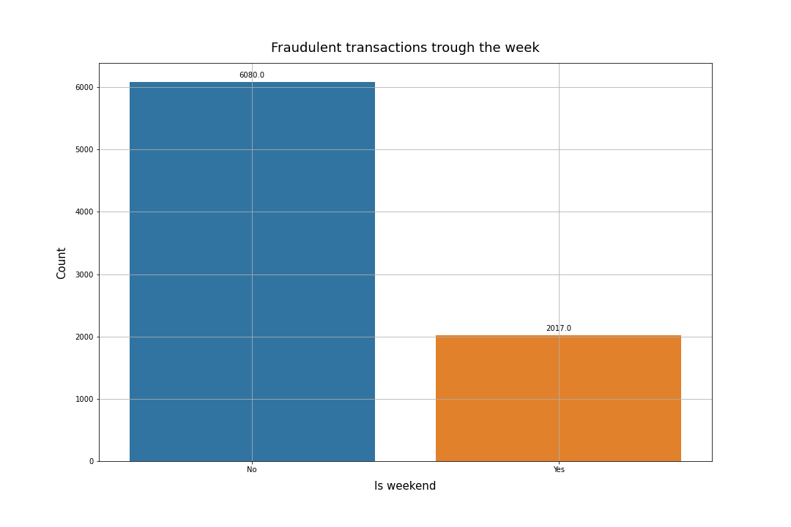 
Fraudulent transactions are more likely to happen during the workweek than weekends.

### Hypothesis 8: Fraudulent transactions tends to happen more on the First month's Fortnight than the Second month's Fortnight

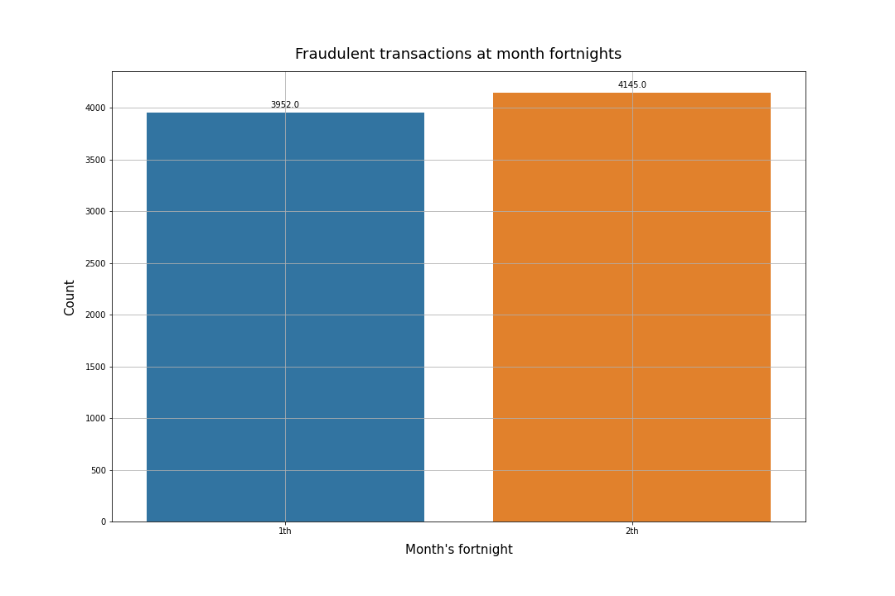 
Despite the fact that transactions are more likely to happen at the first month's fortnight, the fraudulent transactions are more likely to happen, with a slightly difference, at the second month's fortnight.

## Multivariate Analysis

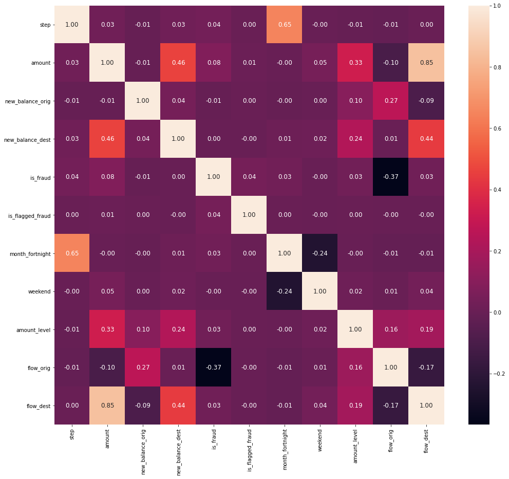 

**There are some variables that have considerable impact over 'is_fraud' result values:**

- **`amount`**
- **`step`**
- **`moth_fortnight`**
- **`amount_level`**
- **`flow_dest`**
- **`is_flagged_fraud`**

# Machine Learning Models Testing

To start, the following machine learning models were tested:

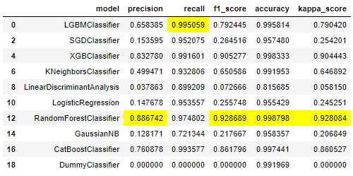 

On the business side we are aiming Recall score. Because only False Negative values (fraudulent transactions that our predict model let it pass) that have a negative impact over the BF company revenue.

So, we will choose the Top 4 best Recall models above to analyze.

# Proposed Machine Learning Model

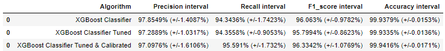 

- All XGB models have almost the same metrics, in general
- XGB Default have a higher Precision than the others XGB models. Which reduces the BF company revenue, because the company wins 5\% for each transaction falsely accused as fraudulent (False Positive). So it will be cut out.
- XGB Tuned & Calibrated have a higher Recall interval than the XGB Tuned, which is a major importance metrics for our business proposal

So, even with the slightly higher Precision interval, **we will choose the the XGB Tuned & Calibrated model as the final model to propose,  because of it's significant higher Recall.**

**OBS:** For more about the decisions made and how it was done: [Blocker Fraud notebook](https://github.com/pedrofratucci/Blocker_Fraud_Company/blob/main/notebooks/blocker_fraud_PH.ipynb)

# Business Solution Performance

## Bank Business Methods Comparison

 

## Blocker Fraud Company Revenue

 
  
# Further Improvements

- Develop an app that intakes a transaction and flags it's probability of being fraudulent or not

- Build a model retraining pipeline as the database of transactions grow

# References

## Business Problem Source
- https://sejaumdatascientist.com/crie-uma-solucao-para-fraudes-em-transacoes-financeiras-usando-machine-learning/

## Data Source
- https://www.kaggle.com/ntnu-testimon/paysim1
